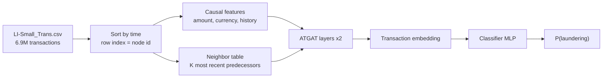
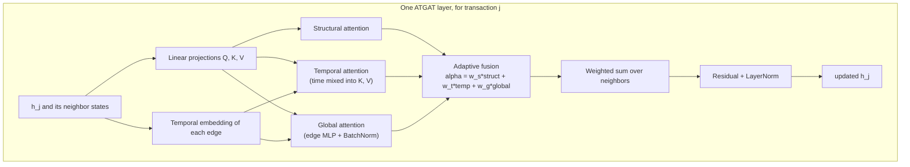

# ATGAT for Money-Laundering Detection — From Graph Attention Networks to Our Implementation

This document explains, from first principles, how our fraud-detection model works: what a Graph Attention Network (GAT) is, why plain GAT isn't enough for transaction data, how the **ATGAT** paper extends it with temporal awareness, and exactly how we adapted that architecture to a real dataset — the [IBM Anti-Money-Laundering (AML) dataset](https://www.kaggle.com/datasets/ealtman2019/ibm-transactions-for-anti-money-laundering-aml), `LI-Small_Trans.csv`.

Reference paper: Zheng, Zhou & Song, *"Temporal-Aware Graph Attention Network for Cryptocurrency Transaction Fraud Detection"* ([arXiv:2506.21382](https://arxiv.org/abs/2506.21382)).

---

## TL;DR (no math)

- We treat every **transaction** as a node in a graph, not every account.
- Two transactions are connected if money flows from one into the account that sent the other — so the graph literally traces **the path money takes through the financial system**.
- A **Graph Attention Network** lets each transaction look at the handful of transactions that fed money into it, and learn *how much attention to pay to each one*, instead of treating them all equally.
- **ATGAT** adds a sense of *time*: it doesn't just look at who sent money to whom, it also learns to weigh *how recently* that happened, using three different "attention lenses" (structure, time, and a global view) that get blended together.
- We trained this on 6.9 million real transactions and it caught money-laundering transactions more than twice as effectively (measured by PR-AUC) as a strong XGBoost baseline given the exact same information.

Everything below explains how, and why, in increasing detail.

---

## Table of Contents

1. [Background: graphs, nodes, and message passing](#1-background-graphs-nodes-and-message-passing)
2. [Graph Attention Networks (GAT)](#2-graph-attention-networks-gat)
3. [Why plain GAT struggles with transaction data](#3-why-plain-gat-struggles-with-transaction-data)
4. [ATGAT: adding temporal awareness](#4-atgat-adding-temporal-awareness)
5. [Adapting ATGAT to IBM AML data](#5-adapting-atgat-to-ibm-aml-data)
6. [Our architecture, precisely](#6-our-architecture-precisely)
7. [Training setup](#7-training-setup)
8. [Ablation variants](#8-ablation-variants)
9. [Results](#9-results)
10. [Where we deviated from the paper, and why](#10-where-we-deviated-from-the-paper-and-why)
11. [Limitations & next steps](#11-limitations--next-steps)
12. [Reference](#12-reference)

---

## 1. Background: graphs, nodes, and message passing

A **graph** is just a set of things (**nodes**) and connections between them (**edges**). A social network is a graph of people connected by friendships; a road network is a graph of intersections connected by streets. A transaction network is a graph too — and how you choose to define "node" and "edge" changes everything about what the model can learn.

**Node classification** means: given a graph where some nodes carry a label (e.g. *legitimate* or *fraudulent*) and others don't, predict the missing labels using both each node's own features *and* the structure of the graph around it.

**Message passing** is the core idea behind almost all modern Graph Neural Networks (GNNs). Each node starts with a feature vector (its own attributes). In each *layer* of the network:

1. Every node collects information ("messages") from its neighbors.
2. It combines those messages with its own current state.
3. It produces an updated representation.

Stack a few of these layers and a node's final representation has absorbed information from neighbors several hops away — e.g. "this account received money from an account that itself received money from a known scam wallet three hops ago."

The simplest message-passing rule just **averages** neighbor features (this is roughly what a Graph Convolutional Network, GCN, does). That treats every neighbor as equally important — which is rarely true. **Attention** fixes that.

---

## 2. Graph Attention Networks (GAT)

A GAT ([Veličković et al., 2018](https://arxiv.org/abs/1710.10903)) lets each node **learn how much to weigh each of its neighbors**, instead of averaging them all equally — the same idea Transformers use for words in a sentence, applied to a graph's edges instead.

For a node $j$ with neighbors $i \in \mathcal{N}(j)$:

$$
\alpha_{ij} = \frac{\exp\big(\text{score}(h_i, h_j)\big)}{\sum_{i' \in \mathcal{N}(j)} \exp\big(\text{score}(h_{i'}, h_j)\big)}
$$

$\alpha_{ij}$ is the **attention weight** — how much node $j$ should "listen to" neighbor $i$, normalized (via softmax) so all of $j$'s neighbor weights sum to 1. The score function is usually a small learned function of the two nodes' current features (a dot product, or a small neural net). The node then updates itself as a weighted sum of its neighbors:

$$
h_j' = \sigma\!\left(\sum_{i \in \mathcal{N}(j)} \alpha_{ij}\, W h_i\right)
$$

**Multi-head attention** runs several independent versions of this in parallel (different learned score functions) and concatenates the results — the same node might simultaneously pay attention to "who sent the most money" *and* "who is structurally most central," through different heads.

This is the base building block ATGAT extends. On its own, though, a GAT has **no notion of time** — it looks at a snapshot of the graph and has no way to tell "this neighbor connected an hour ago" from "this neighbor connected a year ago."

---

## 3. Why plain GAT struggles with transaction data

Two problems specific to fraud/AML detection that a vanilla GAT doesn't address:

1. **Time matters.** A chain of transactions moving money through five accounts *within twenty minutes* looks very different from the same chain spread over *six months* — the first is a classic layering pattern; the second is probably unrelated. Structure alone can't distinguish them.
2. **Extreme class imbalance.** In our data, laundering transactions are **0.05%** of the total. A model optimizing plain cross-entropy will happily predict "not laundering" for everything and still be over 99.9% accurate — while being completely useless.

ATGAT addresses both.

---

## 4. ATGAT: adding temporal awareness

ATGAT (Augmented Temporal-aware Graph Attention Network) keeps the GAT backbone but adds three ingredients on top:

### 4.1 Temporal embedding

For every edge (neighbor $i$ → node $j$), instead of just knowing *that* they're connected, the model computes a rich vector encoding *when* the connection happened, built from three pieces:

- **Basic time-difference projection** — a learned linear map of the raw gap $\Delta t_{ij} = |t_i - t_j|$.
- **Multi-scale features** — the same gap viewed at three different scales: $\Delta t$ (linear), $\log(\Delta t + 1)$ (compresses large gaps), $\sqrt{\Delta t + 1}$ (in between). Concatenated and projected.
- **Periodic position encoding** — a Transformer-style sinusoidal encoding of each transaction's *absolute* timestamp (not just the gap), so the model can also learn patterns like "laundering spikes at certain times."

These three pieces are concatenated and passed through `Linear → LayerNorm → ReLU → Dropout` to produce the final time embedding $e_{\text{time}}^{(ij)}$.

### 4.2 Triple attention

Instead of one attention score per edge, ATGAT computes **three in parallel**, each answering a different question:

| Attention | Question it answers |
|---|---|
| **Structural** ($\alpha^{struct}$) | "How similar/relevant are this neighbor's *features* to mine?" — the standard GAT score. |
| **Temporal** ($\alpha^{temp}$) | "How relevant is this neighbor once I also account for *when* it connected to me?" — the time embedding is mixed into the attention's keys and values. |
| **Global** ($\alpha^{global}$) | "How does this edge compare to *all* edges in the graph/batch, not just this node's neighbors?" — a global normalization step. |

### 4.3 Adaptive fusion

A small learned gate decides, **per node**, how much weight to give each of the three attentions:

$$
\alpha_{ij} = w_s\, \alpha_{ij}^{struct} + w_t\, \alpha_{ij}^{temp} + w_g\, \alpha_{ij}^{global}
$$

This is the interesting part: the model isn't told in advance whether time matters more than structure — it **learns** the mixture, and that mixture is inspectable after training (see [§9](#9-results)).

### 4.4 Handling class imbalance

Standard binary cross-entropy would let the model coast by predicting "legitimate" for everything. ATGAT instead weights the loss so that missing a laundering transaction costs much more than misclassifying a legitimate one:

$$
\mathcal{L} = -\Big[w_{pos}\, y \log(\hat y) + w_{neg}\, (1-y)\log(1-\hat y)\Big], \qquad w_{pos} = \frac{N_{neg}}{N_{pos}}, \; w_{neg} = 1
$$

---

## 5. Adapting ATGAT to IBM AML data

The original paper evaluates on **Elliptic++**, a Bitcoin transaction graph with only **49 coarse time steps** (roughly two-week buckets covering ~2 years). Adapting the idea to IBM AML's `LI-Small_Trans.csv` required rethinking several pieces, because the two datasets have quite different structure:

| | Elliptic++ (paper) | IBM AML — LI-Small_Trans (ours) |
|---|---|---|
| Transactions | 203,769 | **6,924,049** |
| Labeled fraud rate | ~2% (of labeled subset) | **0.051%** (far more imbalanced) |
| Timestamp resolution | 49 discrete steps (~2 weeks each) | **Minute-level** real timestamps |
| Node identity | Bitcoin transaction | Individual bank-style transaction row |

The minute-level timestamps are actually a big deal: with only 49 coarse steps, most *connected* transactions in Elliptic++ likely fall in the *same* time bucket, meaning $\Delta t \approx 0$ for most edges — the temporal module has little to work with. IBM AML gives it real signal (median gap between a transaction and its most recent predecessor: **~16 hours**), which is part of why the results below look meaningfully different from the paper's own.

### 5.1 Problem formulation

Just like the paper, **each transaction (each CSV row) is a graph node** — not each account. An edge $i \to j$ exists when:

- transaction $i$ paid money **into** the account that later **sends** transaction $j$, and
- $i$ happened **before** $j$, and
- $i$ is one of the $K$ most recent such payments (we use $K{=}3$).

In other words: *follow the money*. This directly encodes the "layering" pattern common in money laundering — money hopping quickly through a chain of accounts.

### 5.2 A dense neighbor table instead of a graph library

Because every node has **at most $K{+}1$ neighbors by construction** (itself, plus its $K$ predecessors), we don't need a general-purpose graph library's neighbor sampler at all. We precompute one array:

```
NBR[j] = [ j, i_1, i_2, i_3 ]     # slot 0 = self-loop, slots 1..K = most recent predecessors, -1 = padding
```

This is built in a handful of vectorized NumPy operations (one global sort, no per-node Python loop), and every attention layer simply gathers `K+1` rows from this table. It's mathematically identical to a GAT layer restricted to this graph, exact (no neighbor *sampling* approximation), and avoids heavy dependencies like `torch-sparse` / `pyg-lib` entirely.

### 5.3 Features (kept strictly causal)

Every feature a transaction-node carries is computable using **only information available before that transaction happened**:

- Log-scaled amount paid / received
- Same-currency / same-bank / self-transfer flags
- Hour-of-day (sine/cosine encoded)
- **Causal history features**: how many prior transactions this sender/receiver account has made, and how long ago their previous transaction was (`cumcount` / `diff`, computed only over earlier rows)

All numeric features are standardized using statistics computed **only from the training period**, so nothing about the future leaks into the normalization.

### 5.4 A chronological split, not a random one

The paper uses a random 8:1:1 split. We use a **chronological 60/20/20 split** instead — train on the earliest 60% of transactions by time, validate on the next 20%, test on the most recent 20%. This matters a lot in practice:

- A random split lets a model implicitly "see the future" (a training transaction can sit right next to a test transaction in time, and even share edges with it).
- Our neighbor table only ever points **backward** in time, so a transaction's embedding is built purely from its past — verified with an explicit test that scrambling *future* rows changes nothing about a given transaction's prediction, while scrambling *past* rows does.

---

## 6. Our architecture, precisely



Each **ATGAT layer** does the following for a node $j$ and its neighbor slots (self + $K$ predecessors):



**Implementation notes:**

- `TemporalEmbedding` implements §4.1 exactly: widths $d_1 = d_3 = d_t/4$, $d_2 = d_t/2$ (we use $d_t{=}32$), $\Delta t$ measured in hours.
- `ATGATLayer` implements §4.2–4.3: structural attention is scaled dot-product; temporal attention adds the time embedding into keys *and* values before scoring; global attention scores each edge with a small MLP on `[h_dst, h_neighbor, e_time]`, normalized with BatchNorm across all real edges in the batch (our interpretation of the paper's "global normalization" — see [§10](#10-where-we-deviated-from-the-paper-and-why)); the fusion gate is a 2-layer MLP producing per-node, per-head softmax weights over whichever attentions are active.
- `GATLayer` is a plain additive-attention GAT with no time information at all — used as the **B-GAT** baseline inside the *same* wrapper (same input projection, residual, classifier), so ablating attention type doesn't also change unrelated architecture.
- The classifier is a 2-layer MLP applied to the target transaction's final embedding, producing a single logit.
- Model size: **70,001 parameters** — small by design, since the neighborhood is tiny and precise rather than large and sampled.

---

## 7. Training setup

| Setting | Value |
|---|---|
| Hidden size / heads / layers | 64 / 4 / 2 |
| Temporal embedding / positional dim | $d_t{=}32$, $d_{pos}{=}16$ |
| Positional encoding mode | `daily` (cyclic, 24h) — see [§10](#10-where-we-deviated-from-the-paper-and-why) |
| Dropout | 0.2 |
| Optimizer | AdamW, lr $5{\times}10^{-3}$, weight decay $10^{-4}$, cosine annealing |
| Epochs / batch size | 15 / 2048 |
| Negative sampling | all laundering transactions + 50 fresh random negatives per positive, **redrawn every epoch** |
| Loss | weighted BCE, $w_{pos} = N_{neg}/N_{pos}$ of that epoch's sample |
| Model/threshold selection | best-epoch and decision threshold both chosen on **validation** PR-AUC / F1, never on test |

**Why down-sample negatives per epoch?** With 0.05% positives, one epoch over the full 4.15M-row training set would mean showing the model roughly 2,300 negatives for every positive — most of an epoch is spent on data that teaches it nothing new. Sampling a fresh batch of negatives every epoch keeps training fast while still exposing the model to the whole negative population over time, and the class-weighted loss corrects for the resulting imbalance in the *sample*, not the population.

Because of this down-sampling, raw output probabilities aren't calibrated to the true 0.05% base rate — so we never threshold at 0.5. Instead we sweep the precision-recall curve on the **validation** period and pick the F1-maximizing threshold, then apply that fixed threshold once to test.

---

## 8. Ablation variants

Mirroring the paper's own ablation, the same wrapper supports five configurations by turning attention branches on/off:

| Variant | Structural | Temporal | Global | Weighted loss |
|---|:---:|:---:|:---:|:---:|
| B-GAT | — (plain GAT) | — | — | — |
| S-GAT | ✔ | | | |
| T-GAT | | ✔ | | |
| ATGAT | ✔ | ✔ | ✔ | |
| **ATGAT-W** | ✔ | ✔ | ✔ | ✔ |

This isolates *what the temporal/global attention adds* on top of a structurally-identical model, rather than conflating it with other architecture changes.

---

## 9. Results

### 9.1 Paper's own benchmark (Elliptic++, for reference)

| Model | Accuracy | Precision | Recall | F1-Macro | AUC |
|---|---|---|---|---|---|
| XGBoost | 0.9803 | 0.9358 | 0.6755 | 0.8872 | 0.8364 |
| GCN (weighted) | 0.8997 | 0.3036 | 0.6887 | 0.6832 | 0.8683 |
| **ATGAT-W (paper)** | 0.9715 | 0.7924 | 0.6278 | 0.8427 | **0.9130** |

*(Note: on Elliptic++, tree-based baselines actually beat ATGAT on precision/F1 — only AUC clearly favors it.)*

### 9.2 Our run — full `LI-Small_Trans.csv`, chronological split, real held-out future data

6,924,049 transactions · 705,903 accounts · 3,565 laundering (0.051%) · test period: 1,384,600 transactions / 925 laundering, never seen during training.

| Model | ROC-AUC | PR-AUC | F1 | Precision | Recall |
|---|---|---|---|---|---|
| XGBoost (same features, same split) | 0.9436 | 0.0648 | 0.0783 | 0.0722 | 0.0854 |
| **ATGAT-W** | **0.9621** | **0.1455** | **0.2163** | **0.3861** | **0.1503** |

Random-guess PR-AUC at this base rate is 0.0007 — so ATGAT-W achieves roughly a **200× lift**, and more than **2×** XGBoost's PR-AUC, on a genuinely held-out, future time window, with both models given identical tabular features.

### 9.3 What the model actually learned to attend to

After training, we can read off the fusion gate's average weights:

| Layer | Structural weight | Temporal weight | Global weight |
|---|---|---|---|
| 1 | 0.24 | **0.63** | 0.13 |
| 2 | 0.26 | **0.52** | 0.22 |

**Temporal attention dominates in both layers.** This is a meaningful validation of the paper's core idea — but notably, it's a *clearer* signal here than it was on Elliptic++'s coarse 49-step timestamps, precisely because IBM AML's minute-level timestamps give the temporal module something real to work with.

---

## 10. Where we deviated from the paper, and why

The paper leaves some components underspecified; here's exactly what we implemented and why, so it's easy to audit or revisit:

- **Global attention.** The paper describes it only as "global normalization of all edge features," with no formula. We implemented it as an edge-conditioned MLP score, normalized with `BatchNorm` across all real edges in the batch before the per-node softmax. This is our interpretation, not a literal reproduction.
- **Adaptive fusion.** Implemented as per-node, per-head softmax gate weights from a small MLP on the target node's state — the paper specifies the *existence* of $[w_s, w_t, w_g]$ but not how they're computed.
- **Positional encoding mode.** The paper's eq. (4) uses *absolute* timestamps directly. Under a chronological split, test-period timestamps are numerically outside the range the model trained on, so we default to encoding time **cyclically within a day** instead (`PE_MODE = "daily"`) — the literal absolute-timestamp version is available as a toggle.
- **Split protocol.** Chronological 60/20/20 (ours) vs. random 8:1:1 (paper) — see [§5.4](#54-a-chronological-split-not-a-random-one) for why.
- **B-GAT baseline.** Built inside the exact same wrapper (input layer, residual, classifier) as every other variant, so that the ablation isolates the attention mechanism rather than incidental architecture differences.
- **Negative sampling.** Not in the paper at all — added purely for training speed at this scale; the weighted loss is applied *on top of* the sampled batch, not the full population.

---

## 11. Limitations & next steps

- **Recall is still low in absolute terms** (15% at the F1-optimal threshold) — for a real screening pipeline where a human reviews a ranked list, the full precision-recall curve matters more than a single threshold, and a recall-first operating point may be preferable.
- **Single training run.** With only 925 test-period positives, PR-AUC carries real sampling noise. Multiple seeds (the ablation cell supports this) would give a confidence interval rather than a point estimate, matching the paper's own use of repeated runs.
- **Narrow receptive field.** With $K{=}3$ and 2 layers, most transactions see only ~2 real predecessors on average — deeper layering chains may need a larger $K$ or more layers.
- **Only money-flow (in-flow) edges are modeled.** Adding a sender's own transaction history as edges, or a second hop through the receiver's side, are natural extensions.

---

## 12. Reference

Zheng, Z., Zhou, B., & Song, Y. (2025). *Temporal-Aware Graph Attention Network for Cryptocurrency Transaction Fraud Detection.* arXiv:2506.21382. https://arxiv.org/abs/2506.21382
